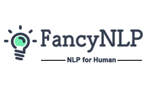
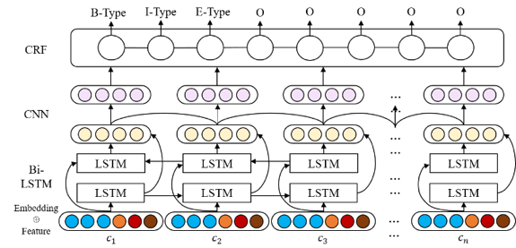
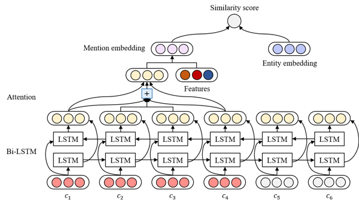

# Fancy-NLP




[](https://travis-ci.org/boat-group/fancy-nlp)

[](https://coveralls.io/github/boat-group/fancy-nlp?branch=master)
[](http://commitizen.github.io/cz-cli/)


## 基本介绍

fancy-nlp 是由腾讯广告 AMS 创意优化组团队构建的用于建设商品画像的文本知识挖掘工具，其支持诸如实体提取、文本分类等多种常见NLP任务。与当前业界常用框架相比，其能够支持用户快速的功能迭代：既可以满足高阶用户对模型进行深度定制，也可以让普通用户快速利用预训练的模型进行功能使用。在当前的商品广告业务场景中，我们利用fancy-nlp快速挖掘海量商品数据的特征，从而支持广告商品推荐等业务需求场景中。项目的初衷是希望提供一套面向文本的、易用的自然语言处理工具，其直接面向业务场景，满足用户对自然语言处理任务的需求，使得用户无需处理复杂的预处理等中间过程，直接针对输入的自然语言文本来完成多种NLP任务，实现所想即所得！

### Highlight

* 实体提取
* 文本分类
* 快速迭代
* 一键式Predict
* 预训练模型加载


## fancy是什么寓意？

对于当前众多的NLP任务，例如序列标注、文本分类，大多数工具的设计都是偏向于模型的训练和评估。当普通用户希望将这些模型应用于实际业务场景中时，往往需要进行复杂的预处理和部署配置，这些过程往往和用户所期望的流程不符。因此`fancy`的寓意为**满足你的想象**，你可以在`fancy-nlp`中实现对NLP任务各个环节的一键式处理，高效将模型应用于实际的业务中。

## 安装

`fancy-nlp`当前支持在Python 3环境下使用：

```
pip install fancy-nlp
pip install git+https://www.github.com/keras-team/keras-contrib.git
```

## 知识实体识别使用指引

### 自定义模型
在当前的商品画像构建业务中，我们为海量的商品建立了基础的商品画像信息，使用`fancy-nlp`可以基于商品名的文本信息，分别使用一行代码，实现对商品品牌、型号等知识实体的提取。

在当前的业务场景中，知识实体的提取准确率F1值可以达到**0.8692**。

```python
>>> from fancy_nlp.applications import NER
# 获取NER实例
>>> ner_app = NER()
# 加载你的训练集和验证集
>>> from fancy_nlp.utils import load_ner_data_and_labels
>>> train_data, train_labels = load_ner_data_and_labels('/your/path/to/train.txt')
>>> valid_data, valid_labels = load_ner_data_and_labels('/your/path/to/valid.txt')
# 开始训练模型
>>> ner_app.fit(train_data, train_labels, valid_data, valid_labels,
               ner_model_type='bilstm_cnn',
               char_embed_trainable=True,
               callback_list=['modelcheckpoint', 'earlystopping', 'swa'],
               checkpoint_dir='pretrained_models',
               model_name='dpa_ner_bilstm_cnn_crf',
               load_swa_model=True)
# 使用测试集评估模型效果
>>> test_data, test_labels = load_ner_data_and_labels('./your/path/to/test.txt')
>>> ner_app.score(test_data, test_labels)
Recall: 0.8922289546443909, Precision: 0.8474131187842217, F1: 0.8692437745364932
...
>>> ner_app.restrict_analyze('小米9SE骁龙712全息幻彩紫8GB+128GB游戏智能拍照手机')
{'text': '小米9SE骁龙712全息幻彩紫8GB+128GB游戏智能拍照手机',
 'entities': [{'name': '小米',
   'type': '品牌',
   'score': 0.9986118674278259,
   'beginOffset': 0,
   'endOffset': 2},
  {'name': '骁龙712',
   'type': '型号',
   'score': 0.9821863174438477,
   'beginOffset': 5,
   'endOffset': 10},
  {'name': '手机',
   'type': '类别',
   'score': 0.9981447458267212,
   'beginOffset': 30,
   'endOffset': 32}]}
>>> ner_app.analyze('小米9SE骁龙712全息幻彩紫8GB+128GB游戏智能拍照手机')
{'text': '小米9SE骁龙712全息幻彩紫8GB+128GB游戏智能拍照手机',
 'entities': [{'name': '小米',
   'type': '品牌',
   'score': 0.9986118674278259,
   'beginOffset': 0,
   'endOffset': 2},
  {'name': '9SE',
   'type': '型号',
   'score': 0.8843186497688293,
   'beginOffset': 2,
   'endOffset': 5},
  {'name': '骁龙712',
   'type': '型号',
   'score': 0.9821863174438477,
   'beginOffset': 5,
   'endOffset': 10},
  {'name': '手机',
   'type': '类别',
   'score': 0.9981447458267212,
   'beginOffset': 30,
   'endOffset': 32}]}

``` 

### 基础模型

当前fancy-nlp中默认加载了使用MSRA NER数据集训练的NER模型，其能够对中文文本中的组织机构（ORG）、地点（LOC）以及人物（PER）进行识别。当前的基础模型仅为便于用户直接体验，暂未进行深度的模型调优。目前，你可以根据后续的**自定义模型**使用介绍，来构建你的实体提取系统。

*注：我们将在随后不断优化多种场景（不同标注数据）的实体识别模型，以供用户直接使用*

```python
>>> from fancy_nlp.applications import NER
# 获取NER实例
>>> ner_app = NER()
# analyze: 输出文本中的实体信息
>>> ner_app.analyze('同济大学位于上海市杨浦区，校长为陈杰')
{'text': '同济大学位于上海市杨浦区，校长为陈杰',
 'entities': [{'name': '同济大学',
   'type': 'ORG',
   'score': 1.0,
   'beginOffset': 0,
   'endOffset': 4},
  {'name': '上海市',
   'type': 'LOC',
   'score': 1.0,
   'beginOffset': 6,
   'endOffset': 9},
  {'name': '杨浦区',
   'type': 'LOC',
   'score': 1.0,
   'beginOffset': 9,
   'endOffset': 12},
  {'name': '陈杰',
   'type': 'PER',
   'score': 1.0,
   'beginOffset': 16,
   'endOffset': 18}]}
# restrict_analyze: 限制输出结果中，每种实体只保留一个实体，取得分最高的实体
>>> ner_app.restrict_analyze('同济大学位于上海市杨浦区，校长为陈杰')
{'text': '同济大学位于上海市杨浦区，校长为陈杰',
 'entities': [{'name': '同济大学',
   'type': 'ORG',
   'score': 1.0,
   'beginOffset': 0,
   'endOffset': 4},
  {'name': '杨浦区',
   'type': 'LOC',
   'score': 1.0,
   'beginOffset': 9,
   'endOffset': 12},
  {'name': '陈杰',
   'type': 'PER',
   'score': 1.0,
   'beginOffset': 16,
   'endOffset': 18}]}
# predict: 查看具体的序列标注结果
>>> ner_app.predict('同济大学位于上海市杨浦区，校长为陈杰')
['B-ORG',
 'I-ORG',
 'I-ORG',
 'I-ORG',
 'O',
 'O',
 'B-LOC',
 'I-LOC',
 'I-LOC',
 'B-LOC',
 'I-LOC',
 'I-LOC',
 'O',
 'O',
 'O',
 'O',
 'B-PER',
 'I-PER']
``` 

### BERT 

`fancy-nlp` 提供了各种使用 bert 的方法: 1) 直接微调 bert 模型完成 NLP 任务；2) 使用 bert 模型输出的向量作为下游任务模型的特征输入；3) 结合 bert 模型输出的向量与其他特征向量作为下游任务模型的特征输入。要想在 `fancy-nlp` 使用 bert，你只需要下载好预训练的 bert 模型（如 google 的中文 [bert](https://storage.googleapis.com/bert_models/2018_11_03/chinese_L-12_H-768_A-12.zip)、百度的 [ernie](https://pan.baidu.com/s/1I7kKVlZN6hl-sUbnvttJzA)、哈工大的 [bert_wwm](https://drive.google.com/file/d/1RoTQsXp2hkQ1gSRVylRIJfQxJUgkfJMW/view)），然后在 `fit` 方法中传入 bert 模型的词表文件、配置文件、模型文件的路径。下面给出三种使用方法的例子。

1. **微调bert**  
```python
>>> from keras.optimizers import Adam
>>> from fancy_nlp.applications import NER
# 获取NER实例
>>> ner_app = NER()
# 加载你的训练集和验证集
>>> from fancy_nlp.utils import load_ner_data_and_labels
>>> train_data, train_labels = load_ner_data_and_labels('/your/path/to/train.txt')
>>> valid_data, valid_labels = load_ner_data_and_labels('/your/path/to/valid.txt')
# 开始训练模型
>>> ner_app.fit(train_data, train_labels, valid_data, valid_labels,
                ner_model_type='bert',  # 设置ner模型类型为'bert'
			    use_char=False,       
                use_bert=True,  # 设置只使用bert输入
                bert_vocab_file='/your/path/to/vocab.txt',  # 传入bert模型各文件的路径
                bert_cofig_file='/your/path/to/bert_config.json',
	            bert_checkpoint_file='your/path/to/bert_nodel.ckpt',
                bert_trainable=True,  # 设置bert可训练
                use_word=False,
                optimizer=Adam(1e-5),  # 使用小一点学习率的优化器
                callback_list=['modelcheckpoint', 'earlystopping', 'swa'],
                checkpoint_dir='pretrained_models',
                model_name='ner_bert_crf',
                load_swa_model=True)
``` 

2. **使用bert输出向量作为下游任务模型的特征输入**   
```python
>>> from keras.optimizers import Adam
>>> from fancy_nlp.applications import NER
# 获取NER实例
>>> ner_app = NER()
# 加载你的训练集和验证集
>>> from fancy_nlp.utils import load_ner_data_and_labels
>>> train_data, train_labels = load_ner_data_and_labels('/your/path/to/train.txt')
>>> valid_data, valid_labels = load_ner_data_and_labels('/your/path/to/valid.txt')
# 开始训练模型
>>> ner_app.fit(train_data, train_labels, valid_data, valid_labels,
                ner_model_type='bilstm_cnn',  # 设置任一ner模型
			    use_char=False,       
                use_bert=True,  # 设置只使用bert向量作为特征输入
                bert_vocab_file='/your/path/to/vocab.txt',  # 传入bert模型各文件的路径
                bert_cofig_file='/your/path/to/bert_config.json',
	            bert_checkpoint_file='your/path/to/bert_nodel.ckpt',
                bert_trainable=True,  # 设置bert训练方法（固定和微调均可）
                use_word=False,
                optimizer=Adam(1e-5),  # 使用小一点学习率的优化器
                callback_list=['modelcheckpoint', 'earlystopping', 'swa'],
                checkpoint_dir='pretrained_models',
                model_name='ner_bilstm_cnn_bert_crf',
                load_swa_model=True)
``` 
3. **结合bert输出向量以及其他特征向量**  
```python
>>> from keras.optimizers import Adam
>>> from fancy_nlp.applications import NER
# 获取NER实例
>>> ner_app = NER()
# 加载你的训练集和验证集
>>> from fancy_nlp.utils import load_ner_data_and_labels
>>> train_data, train_labels = load_ner_data_and_labels('/your/path/to/train.txt')
>>> valid_data, valid_labels = load_ner_data_and_labels('/your/path/to/valid.txt')
# 开始训练模型
>>> ner_app.fit(train_data, train_labels, valid_data, valid_labels,
                ner_model_type='bilstm_cnn',  # 设置任一ner模型
			    use_char=True,         
                use_bert=True,  # 结合字向量以及bert向量作为特征输入
                bert_vocab_file='/your/path/to/vocab.txt',  # 传入bert模型各文件的路径
                bert_cofig_file='/your/path/to/bert_config.json',
	            bert_checkpoint_file='your/path/to/bert_nodel.ckpt',
                bert_trainable=True,  # 设置bert训练方法（固定和微调均可）
                use_word=False,
                optimizer=Adam(1e-5),  # 使用小一点学习率的优化器
                callback_list=['modelcheckpoint', 'earlystopping', 'swa'],
                checkpoint_dir='pretrained_models',
                model_name='ner_bilstm_cnn_char_bert_crf',
                load_swa_model=True)
``` 

## 文本分类使用指引

### 自定义模型
在当前的商品画像构建业务中，我们为海量的商品建立了基础的商品画像信息，使用`fancy-nlp`可以基于商品名的文本信息，使用一行代码，实现对商品类目的获取。在目前的实际业务场景中，商品分类准确率可以达到**0.8428**。

```python
>>> from fancy_nlp.utils import load_text_classification_data_and_labels
# 加载自定义业务数据集，并将其拆分为train、valid以及test
>>> train_data, train_labels, valid_data, valid_labels, test_data, test_labels = load_text_classification_data_and_labels(
    '/path/to/your/data.txt',
    label_index=1,
    text_index=3,
    delimiter='_!_',
    split_mode=2,
    split_size=0.3)

>>> from fancy_nlp import applications
# 不加载基础模型，可以使用自定义的label_dict_file来指明标签的实际名称，该文件为两列，第一列为数据集中的标签名称，第二列为易于理解的标签名称，两列文本以tab分隔
>>> text_classification_app = applications.TextClassification(use_pretrained=False)

text_classification_app.fit(train_data, train_labels, valid_data, valid_labels,
            text_classification_model_type='rcnn',
            char_embed_trainable=True,
            callback_list=['modelcheckpoint', 'earlystopping', 'swa'],
            checkpoint_dir='pretrained_models',
            model_name='text_classification_rcnn',
            label_dict_file='/your/path/to/label_dict.txt',
            max_len=60,
            epochs=50,
            load_swa_model=True)
...
...
...
# 训练完毕后，可以评估模型在测试集中的得分
>>> text_classification_app.score(test_data, test_labels)
# 使用一行代码对输入文本进行商品类目的预测
>>> text_classification_app.predict('亿色(ESR)红米k20/红米k20pro钢化膜 全屏覆盖防指纹 自营无白边小米Redmi k20pro防爆手机贴膜保护膜 高清')
'手机通讯|手机配件|手机贴膜'
# 输出结果中附带预测的概率值
>>> text_classification_app.analyze('亿色(ESR)红米k20/红米k20pro钢化膜 全屏覆盖防指纹 自营无白边小米Redmi k20pro防爆手机贴膜保护膜 高清')
('手机通讯|手机配件|手机贴膜', 0.9966506)
```

### 基础模型

fancy-nlp中默认加载了在当前公开的中文新闻标题分类数据集训练得到的文本分类模型，其能够针对新闻标题文本，预测其所属的新闻类别。

```python
>>> from fancy_nlp import applications
>>> text_classification_app = applications.TextClassification()
>>> text_classification_app.predict('苹果iOS占移动互联网流量份额逾65% 位居第一')
'科技'
>>> text_classification_app.analyze('苹果iOS占移动互联网流量份额逾65% 位居第一')
('科技', 0.9981864)
```

### Bert

文本分类模型和知识实体识别模型一样，支持对Bert Embedding的使用，具体使用方式可以参照知识实体识别指引中的介绍。

## 文本相似度匹配使用指引

### 自定义模型
使用`fancy-nlp`可以基于文本对信息，使用一行代码，实现对文本间相似程度的判断。

```python
>>> from fancy_nlp.utils import load_spm_data_and_labels
# 加载自定义数据集，并将其拆分为train、valid以及test
>>> train_data, train_labels, valid_data, valid_labels, test_data, test_labels = load_spm_data_and_labels(
    '/path/to/your/data.txt',
    split_mode=2,
    split_size=0.3)

>>> from fancy_nlp import applications
# 不加载基础模型，可以使用自定义的label_dict_file来指明标签的实际名称，该文件为两列，第一列为数据集中的标签名称，第二列为易于理解的标签名称，两列文本以tab分隔
>>> spm_app = applications.SPM(use_pretrained=False)

spm_app.fit(train_data, train_labels, valid_data, valid_labels,
            spm_model_type='siamese_cnn',
            word_embed_trainable=True,
            callback_list=['modelcheckpoint', 'earlystopping', 'swa'],
            checkpoint_dir='pretrained_models',
            model_name='spm_siamese_cnn',
            label_dict_file='/your/path/to/label_dict.txt',
            max_len=60,
            epochs=50,
            load_swa_model=True)
...
...
...
# 训练完毕后，可以评估模型在测试集中的F1得分
>>> spm_app.score(test_data, test_labels)
# 使用一行代码对输入文本对进行匹配度的预测
>>> spm_app.predict(['Text_A', 'Text_B'])
# 输出结果中附带预测的概率值
>>> spm_app.analyze(['Text_A', 'Text_B'])
```

### 基础模型

fancy-nlp中默认加载了在当前公开的微众银行客服问句匹配数据集训练得到的文本相似度匹配模型，其能够针对问句文本对，预测其是否表达相同意图。

```python
>>> from fancy_nlp import applications
>>> spm_app = applications.SPM()
# 预测问题对是否表达相同意图（'1'：相同意图，'0'：不同意图）
>>> spm_app.predict(['未满足微众银行审批是什么意思', '为什么我未满足微众银行审批'])
'1'
>>> spm_app.analyze(['未满足微众银行审批是什么意思', '为什么我未满足微众银行审批'])
('1', [0.0000325, 0.9999675])
```

### Bert
文本相似度匹配模型和知识实体识别模型一样，支持对微调Bert和Bert Embedding的使用，具体使用方式可以参照知识实体识别指引中的介绍。
其中Bert Embedding只能与字符向量共同使用，不能与词向量共同使用。

## 模型架构
### 知识实体识别
对于知识实体识别，我们使用字向量序列作为基础输入，并在此基础上：

- 加入bert特征向量；
- 加入分词特征，包括字所在词的词向量与位置向量；
- 加入邻接字特征，如bi-gram字向量；
- ...  

然后使用序列标注模型进行序列标注，如BiLSTM, BiLSTM+CRF, BiLSTM+CNN+CRF等。



与基于词序列输入和基于字序列输入的模型相比，本实体识别方法可以显式利用句子中词的语义信息，同时还不会受分词错误的影响。

模型在各种基准数据集（如 [Chinese Daily](https://github.com/zjy-ucas/ChineseNER/tree/master/data)、 [MSRA](https://github.com/Determined22/zh-NER-TF/tree/master/data_path)、 [Weibo NER](https://github.com/hltcoe/golden-horse/tree/master/data)、 [CCKS 2019中文短文本实体链接](https://biendata.com/competition/ccks_2019_el/)）训练的效果对比如下：  

| dataset       | model        | F1    | F1_SWA |
|:-------------:|:------------:|:-----:|:------:|
|Chinese Daily  |BiLSTM_CRF    |0.82847|0.84509 |
|Chinese Daily  |BiLSTM_CNN_CRF|0.84728|0.86270 |
|Chinese Daily  |BiGRU_CRF     |0.82762|0.84478 |
|Chinese Daily  |BiGRU_CNN_CRF |0.84731|0.86559 |
|MSRA           |BiLSTM_CRF    |0.83133|0.84293 |
|MSRA           |BiLSTM_CNN_CRF|0.83899|0.86246 |
|MSRA           |BiGRU_CRF     |0.81850|0.83567 |
|MSRA           |BiGRU_CNN_CRF |0.82936|0.84943 |
|Weibo NER      |BiLSTM_CRF    |0.37027|0.36693 |
|Weibo NER      |BiLSTM_CNN_CRF|0.37301|0.37750 |
|Weibo NER      |BiGRU_CRF     |0.37337|0.40049 |
|Weibo NER      |BiGRU_CNN_CRF |0.39173|0.41147 |
|CCKS2019 Task 2|BiLSTM_CRF    |0.75963|0.76012 |
|CCKS2019 Task 2|BiLSTM_CNN_CRF|0.76575|0.76437 |
|CCKS2019 Task 2|BiGRU_CRF     |0.75507|0.75530 |
|CCKS2019 Task 2|BiGRU_CNN_CRF |0.75954|0.76268 |

### 文本分类模型
对于文本分类模型，我们集成了当前常用的文本分类模型，并进行了对比试验，效果如下：

| 序号 |    模型名   | Precision |  Recall | Macro-F1 | Accuracy | Time(s)/60015个样本 |
|:----:|:-----------:|:---------:|:------:|:--------:|:--------:|:-------------------:|
|   1  |     CNN     |   0.7532  | 0.7453 |  0.7462  |  0.8636  |        4.7972       |
|   2  |     LSTM    |   0.7446  | 0.7339 |  0.7389  |  0.8599  |        4.8093       |
|   3  |   Bi-LSTM   |   0.7436  | 0.7374 |  0.7384  |  0.8594  |        8.7405       |
|   4  |    DPCNN    |   0.7411  | 0.7326 |  0.7333  |  0.8462  |        5.6679       |
|   5  |     RCNN    |   0.7687  | 0.7633 |  0.7639  |  0.8744  |       11.1846       |
|   6  |     DCNN    |   0.6873  | 0.6743 |  0.6746  |  0.7955  |        5.2111       |
|   7  |    VDCNN    |   0.7119  | 0.6981 |  0.7049  |  0.8065  |       53.2978       |
|   8  | Att_Bi-LSTM |   0.7512  | 0.7448 |  0.7549  |  0.8644  |        9.0593       |
|   9  | CNN-Bi-LSTM |   0.7486  | 0.7411 |  0.7422  |  0.8563  |        3.4688       |
|  10  |   FastText  |   0.7313  | 0.7270 |  0.7274  |  0.8400  |        1.1811       |

效果最优的是RCNN模型，这也是我们当前实际采用的模型。若从模型速度和性能兼顾的角度来考虑，也可采用基础的TextCNN模型，其在一般的业务场景中，在训练数据足够的情况下，也足以满足业务需求

### 文本相似度匹配模型
在文本相似度匹配任务中，我们根据给定的两段文本，得到文本间的相似程度。相似度匹配模型通过各种方法将词向量编码为文本对应的句子向量，并计算出句子向量间的匹配得分。除了基本的孪生结构的CNN和Bi
-LSTM模型外，还实现了融合注意力机制的ESIM、BiMPM等模型。

- ESIM：交互注意力机制
- BiMPM：多视角的相似度匹配
- Bert：微调Bert模型


文本匹配模型可用于文本相似度计算、问答、自然语言推理等多项匹配任务中。

对于fancy-nlp中的文本相似度匹配模型，我们在CCKS 2018微众银行智能问句匹配任务[WeBank](https://biendata
.com/competition/CCKS2018_3/)
中进行了对比试验，效果如下：

| 序号 |     模型名    | Precision |  Recall | Macro-F1 | Accuracy |
|:----:|:-------------:|:---------:|:------:|:--------:|:--------:|
|   1  |  Siamese_CNN  |   0.7954  | 0.7604 |  0.7775  |  0.7824  |
|   2  |  Siamese_LSTM |   0.7760  | 0.8119 |  0.7935  |  0.7981  |
|   3  |      ESIM     |   0.8288  | 0.7814 |  0.8044  |  0.8100  |
|   4  |      BiMPM    |   0.8066  | 0.8202 |  0.8134  |  0.8149  |
|   5  |      Bert     |   0.8678  | 0.8102 |  0.8380  |  0.8434  |

## Comming soon

### 知识实体链接
对于实体链接模型，我们先使用基于注意力机制的Bi-LSTM模型抽取实体指称的语义特征，同时融合多种消歧特征：

- 文本相似度特征；
- 实体类型匹配特征；
- 基于文本中所有候选实体所构成的知识子图的多实体联合消歧特征，之后使用排序学习方法对候选实体列表进行排序，得到最佳匹配实体。



与传统方法相比，该链接模型融合多种消歧特征，能有效解决短文本上下文语境不丰富问题，提高泛化能力。

## Acknowledgement

- 本项目所属2019腾讯广告犀牛鸟专项研究计划，并与同济大学大数据处理与智能分析实验室与联合开发
- `fancy-nlp`在**CCKS 2019——中文短文本的实体链指**评测竞赛中取得了初赛第三名，复赛[第五名](https://biendata.com/competition/ccks_2019_el/final-leaderboard/)的成绩，且获得了该评测竞赛唯一的一项[技术创新奖](https://biendata.com/competition/ccks_2019_el/winners/)，可复现流程指引，请参考原始[repo](https://github.com/AlexYangLi/ccks2019_el)。

## Contribution

- 项目的代码规范符合PEP8标准
- 所有的代码提交请遵循[约定式提交规范](https://www.conventionalcommits.org/zh/v1.0.0-beta.4/)
- 为项目添加新的核心代码，请编写相应的单元测试模块

## Reference
本项目的灵感来自于众多的优秀的开源项目，尤其是Keras，正如Keras的slogan: **Deep learning for human** 所说，我们希望`fancy-nlp`是**NLP for human**，尤其在中文领域。

- Keras: <https://github.com/keras-team/keras>
- anoGo: <https://github.com/Hironsan/anago>
- Kashgari: <https://github.com/BrikerMan/Kashgari>

