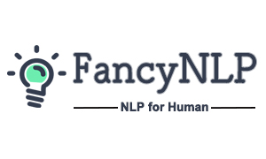

<h1 align="center">Fancy-NLP</h1>

<p align="center">NLP for human. A fast and esay-to-use natural language processing (NLP) toolkit, satisfying your imagination about NLP.</p>

<div align="center">
  
</div>

<p align="center">
  <a href="https://github.com/boat-group/fancy-nlp/stargazers">
    
  </a>
  <a href="https://github.com/boat-group/fancy-nlp/network/members">
    
  </a>
  <a href="https://travis-ci.org/boat-group/fancy-nlp">
    
  </a>
  <a href="https://pypi.org/project/fancy-nlp">
    
  </a>
  <a href="https://pypi.org/project/fancy-nlp">
    
  </a>
  <a href="https://github.com/boat-group/fancy-nlp/blob/master/LICENSE">
    
  </a>
  <a href="https://coveralls.io/github/boat-group/fancy-nlp?branch=master">
    
  </a>
  <a href="http://commitizen.github.io/cz-cli/">
    
  </a> 
</p>

<p align="center">
  <a href="#基本介绍">基本介绍</a> •
  <a href="#安装">安装</a> •
  <a href="#入门指引">入门指引</a> •
  <a href="#详细教程">详细教程</a> •
  <a href="#荣誉奖励">荣誉奖励</a> •
  <a href="#如何贡献代码">如何贡献代码</a> •
  <a href="#引用">引用</a> •
  <a href="致谢">致谢</a>
</p>


<h2 align="center">基本介绍</h2>

**Fancy-NLP** 是由腾讯商品广告策略组团队构建的用于建设商品画像的文本知识挖掘工具，其支持诸如实体提取、文本分类和文本相似度匹配等多种常见 NLP 任务。与当前业界常用框架相比，其能够支持用户进行快速的功能实心：既可以满足高阶用户对模型进行深度定制，也可以让普通用户快速利用预训练的模型快速进行功能实践。在当前的商品广告业务场景中，我们利用该工具快速挖掘海量商品数据的特征，从而支持广告商品推荐等模块中。

**项目的初衷**是希望提供一套易用的NLP工具，其直接面向使用场景，满足用户对NLP任务的需求，使得用户无需处理复杂的预处理等中间过程，直接针对输入的自然语言文本来完成多种NLP任务，实现所想即所得！

**Fancy 是什么寓意？**对于当前众多的NLP任务，例如实体识别（Named Entity Recognizition, NER）、文本分类以及文本相似度匹配（Sentence Pair Matching, SPM），大多数工具的设计都是偏向于模型的训练和评估。当普通用户希望将这些模型应用于实际业务场景中时，往往需要进行复杂的预处理和部署配置，这些过程往往和用户所期望的流程不符。因此 **Fancy** 的寓意为**满足你的想象**，你可以在 Fancy-NLP 中实现对 NLP 任务各个环节的一键式处理，高效将模型应用于实际的需求场景中。

<h2 align="center">安装</h2>

**Fancy-NLP** 当前支持在Python 3环境下使用，且在Python 3.6中进行了完整的测试。当前的版本中已全面依赖 **Tensorflow 2.x**，如果你对模块的兼容性有所担忧，我们建议你使用 [virtualenv](https://virtualenv.pypa.io/en/latest/) 来创建虚拟环境以使用本工具。

Fancy-NLP 支持使用 `pip` 来进行一键式安装：

```bash
pip install fancy-nlp
```

<h2 align="center">入门指引</h2>

在入门指引中，我们将使用预训练模型来带你快速了解和体验 Fancy-NLP 的基本功能。

*注：我们将在随后不断优化多种场景（不同标注数据）的实体识别模型，以供用户直接使用，如果你有相关数据集，也欢迎在 issue 中给我们积极反馈*

### 实体识别使用指引

当前版本的 Fancy-NLP 可以默认加载使用了 [MSRA NER 子集数据](https://github.com/juand-r/entity-recognition-datasets) 训练得到的NER模型，其能够对中文文本中的组织机构（ORG）、地点（LOC）以及人物（PER）实体进行识别，默认加载的基础模型是为了便于用户直接体验。若想直接使用自己训练的自定义模型，你可以惨叫后续**详细教程**中的介绍，来构建你的实体提取系统。

#### 初始化实体识别应用程序

```python
>>> from fancy_nlp.applications import NER
>>> ner_app = NER()
```

第一次运行以上代码时，会从云端下载预训练的 NER 模型。

#### 输出文本中的实体信息

```python
>>> ner_app.analyze('同济大学位于上海市杨浦区，校长为陈杰')
{'text': '同济大学位于上海市杨浦区，校长为陈杰',
 'entities': [
  {'name': '同济大学',
   'type': 'ORG',
   'score': 1.0,
   'beginOffset': 0,
   'endOffset': 4},
  {'name': '上海市',
   'type': 'LOC',
   'score': 1.0,
   'beginOffset': 6,
   'endOffset': 9},
  {'name': '杨浦区',
   'type': 'LOC',
   'score': 1.0,
   'beginOffset': 9,
   'endOffset': 12},
  {'name': '陈杰',
   'type': 'PER',
   'score': 1.0,
   'beginOffset': 16,
   'endOffset': 18}]}
```

#### 限制输出结果中，每种实体只保留一个实体，取得分最高的实体

```python
>>> ner_app.restrict_analyze('同济大学位于上海市杨浦区，校长为陈杰')
{'text': '同济大学位于上海市杨浦区，校长为陈杰',
 'entities': [
  {'name': '同济大学',
   'type': 'ORG',
   'score': 1.0,
   'beginOffset': 0,
   'endOffset': 4},
  {'name': '杨浦区',
   'type': 'LOC',
   'score': 1.0,
   'beginOffset': 9,
   'endOffset': 12},
  {'name': '陈杰',
   'type': 'PER',
   'score': 1.0,
   'beginOffset': 16,
   'endOffset': 18}]}
```

#### 查看具体的序列标注结果

```
>>> ner_app.predict('同济大学位于上海市杨浦区，校长为陈杰')
['B-ORG',
 'I-ORG',
 'I-ORG',
 'I-ORG',
 'O',
 'O',
 'B-LOC',
 'I-LOC',
 'I-LOC',
 'B-LOC',
 'I-LOC',
 'I-LOC',
 'O',
 'O',
 'O',
 'O',
 'B-PER',
 'I-PER']
``` 

### 文本分类使用指引

Fancy-NLP 中默认加载了在当前公开的[中文新闻标题分类数据集](https://github.com/skdjfla/toutiao-text-classfication-dataset)训练得到的文本分类模型，其能够针对新闻标题文本，预测其所属的新闻类别。

#### 初始化文本分类应用程序

```python
>>> from fancy_nlp.applications import TextClassification
>>> text_classification_app = TextClassification()
```

第一次运行以上程序时，会从云端下载预训练模型。

#### 直接预测文本类别

```python
>>> text_classification_app.predict('苹果iOS占移动互联网流量份额逾65% 位居第一')
'科技'
```

#### 输出文本分类得到的目标类别和得分

```python
>>> text_classification_app.analyze('苹果iOS占移动互联网流量份额逾65% 位居第一')
('科技', 0.9981864)
```

### 文本相似度匹配使用指引

Fancy-NLP 中默认加载了在当前公开的[微众银行客服问句匹配数据集](http://icrc.hitsz.edu.cn/info/1037/1162.htm)训练得到的文本相似度匹配模型，其能够针对所提供的文本对，预测其是否表达相同的意图。

#### 初始化文本相似度匹配应用程序

```python
>>> from fancy_nlp.applications import SPM
>>> spm_app = applications.SPM()
```

第一次运行以上程序时，会从云端下载预训练的文本相似度匹配模型。

#### 预测文本对是否表达相同意图

```python
>>> spm_app.predict(('未满足微众银行审批是什么意思', '为什么我未满足微众银行审批'))
'1'
```

预测结果中，`1`表示相同意图或相似文本，`0`表示不同意图或不相似文本。

#### 预测文本对是否表达相同意图及其在不同标签上的得分

```python
>>> spm_app.analyze(('未满足微众银行审批是什么意思', '为什么我未满足微众银行审批'))
('1', [0.0000325, 0.9999675])
```

<h2 align="center">详细教程</h2>

在**详细教程**中，你可以了解如何使用 Fancy-NLP 使用你自己的数据集，构建适用于满足自定义场景的自定义模型，并对 Fancy-NLP 的接口有着更加全面的了解。

### 实体识别任务

我们依然采用上文提到过的 [MSRA NER 子集数据](https://github.com/juand-r/entity-recognition-datasets) 为例，来介绍如何使用已有的数据集，来训练属于自己的实体识别模型。以下所有代码片段的完整版，可参考 `examples/ner_example.py`。

#### 数据集准备

在 Fancy-NLP 中，实体识别应用程序支持使用标准的 NER 数据集格式，每个待识别的字符和其对应的标签采用 `\t` 分隔，句子与句子之间采用空行分隔。标签的格式可以是 `BIO`、`BIOES` 等常见的标准格式。

#### 加载训练集和验证集

使用 Fancy-NLP 提供的接口，我们可以直接对数据集进行加载，并处理成模型所需要的格式。

```python
>>> from fancy_nlp.applications import NER
>>> ner_app = NER(use_pretrained=False)
>>> from fancy_nlp.utils import load_ner_data_and_labels
>>> train_data, train_labels = load_ner_data_and_labels('datasets/ner/msra/train_data')
>>> valid_data, valid_labels = load_ner_data_and_labels('datasets/ner/msra/test_data')
```

`load_ner_data_and_labels` 实现了对 NER 数据集的有效加载，你可以直接将需要加载的数据（训练集、验证集或测试集）文件路径作为参数，这里使用了测试集来作为验证集。实际任务中，你应该具有各自独立的验证集和测试集，从而获得有价值的测试评估结果。

#### 训练模型

当获得了有效的数据后，NER 应用程序就可以开始直接进行模型的训练。

```python
>>> checkpoint_dir = 'pretrained_models'
>>> model_name = 'msra_ner_bilstm_cnn_crf'
>>> ner_app.fit(train_data, train_labels, valid_data, valid_labels,
                ner_model_type='bilstm_cnn',
                char_embed_trainable=True,
                callback_list=['modelcheckpoint', 'earlystopping', 'swa'],
                checkpoint_dir=checkpoint_dir,
                model_name=model_name,
                load_swa_model=True)
```

对于 NER 应用程序的 `fit` 接口，你需要传入之前处理过的训练集和验证集样本，其余参数的含义如下：

- `ner_model_type`： 指明需要使用的模型名称。本例中使用了 `bilstm_cnn` 模型；
- `char_embed_trainable`：字向量层是否是可以进行微调（fine tuning）。本例中是将其置为 `True`，表示可以进行微调;
- `callback_list`：需要使用的回调功能名称。本例中使用的回调功能有：
	- `modelcheckpoint`：使用模型检查点功能。在每次迭代后，保存训练得到的模型；
	- `earlystopping`：使用提前停止功能。若模型的性能在 n 轮迭代（默认 n=5）后没有提升，则结束训练；
	- `swa`：**SWA** 表示 Stochastic Weight Averaging，是一种常见的模型集成策略，能够有效提升模型的性能，更多详情可以参考[论文原文](http://auai.org/uai2018/proceedings/papers/313.pdf)中的介绍；
- `checkpoint_dir`：保存模型文件的目录路径；
- `model_name`：模型文件的文件名；
- `load_swa_model`：模型训练完之后，是否加载 SWA 模型权重。这里置为 `True`，表示使用 SWA 模型；

#### 使用测试集评估模型效果

```python
>>> test_data, test_labels = load_ner_data_and_labels('datasets/ner/msra/test_data')
>>> ner_app.score(test_data, test_labels)
Recall: 0.8922289546443909, Precision: 0.8474131187842217, F1: 0.8692437745364932
```

这里依然使用 `load_ner_data_and_labels` 来处理测试集数据。得到有效的数据格式后，直接使用 NER 应用程序的 `score` 接口来获取模型在测试集中的得分。

#### 保存训练模型

在训练完模型后，需要将任务需要的所有模型相关文件进行保存，以便于在外部其它应用中使用 Fancy-NLP 训练过的模型。

```python
>>> import os
>>> ner_app.save(
        preprocessor_file=os.path.join(checkpoint_dir, f'{model_name}_preprocessor.pkl'),
        json_file=os.path.join(checkpoint_dir, f'{model_name}.json'))
```

NER应用程序的 `save` 接口可以用来将模型的结构文件（json）以及权重文件（hdf5）和预处理的相关结果（pickle）进行持久化保存：

- preprocessor_file：保存的预处理文件；
- json_file：保存的模型结构文件；
- weight_file：保存的权重文件名。通常无需显示指定，因为在先前的模型训练中，通过 `modelcheckpoint` 功能，已经将权重文件进行了保存；

#### 加载先前训练得到的模型进行预测

```python
>>> ner_app.load(
        preprocessor_file=os.path.join(checkpoint_dir, f'{model_name}_preprocessor.pkl'),
        json_file=os.path.join(checkpoint_dir, f'{model_name}.json'),
        weights_file=os.path.join(checkpoint_dir, f'{model_name}_swa.hdf5'))
```

此时的 `ner_app` 就已经具有了对样本进行预测的能力，你就可以完成在 **入门指引** 中提到的相关预测功能。例如，`analyze`、`restrict_analyze`。

### 文本分类任务

我们依然采用上文提到过的 [中文新闻标题分类数据集](https://github.com/skdjfla/toutiao-text-classfication-dataset) 为例，来介绍如何使用已有的数据集，来训练属于自己的文本分类模型。以下所有代码片段的完整版，可参考 `examples/text_classification_example.py`。

#### 数据集准备

在 Fancy-NLP 中，文本分类应用程序支持使用原始文本采用固定分隔符分隔的数据集格式，其可以有多余的和文本分类任务无关的列，只需要保证标签列和输入文本列都处于统一的固定位置即可。

此外，对于分类标签，还需要准备一份标签和标签ID的映射文件，其由两列组成：第一列为标签在数据集中的原始名称，通常为一些编码的ID；第二列为标签原始名称对应的可读名称。该文件的对应关系，将用于在模型预测时，直接输出可读的标签名称。

#### 加载训练集和验证集

使用 Fancy-NLP 提供的接口，我们可以直接对数据集进行加载，并处理成模型所需要的格式。

```python
>>> from fancy_nlp.applications import TextClassification
>>> text_classification_app = TextClassification(use_pretrained=False)
>>> data_file = 'datasets/text_classification/toutiao/toutiao_cat_data.txt'
>>> from fancy_nlp.utils import load_text_classification_data_and_labels
>>> train_data, train_labels, valid_data, valid_labels, test_data, test_labels =
        load_text_classification_data_and_labels(data_file,
                                                 label_index=1,
                                                 text_index=3,
                                                 delimiter='_!_',
                                                 split_mode=2,
                                                 split_size=0.3)
```

`load_ner_data_and_labels` 实现了对文本分类数据集的有效加载，你可以直接将需要加载的数据（训练集、验证集或测试集）文件路径作为参数，这里使用了完整的数据来划分训练集、验证集和测试集。除了数据文件，上述其余参数的具体含义为：

- `label_index`：分类标签在数据文件中所处的位置（位置编号从0开始）；
- `text_index`：待分类文本在数据文件中所处的位置；
- `delimiter`：数据文件各列之间的分隔符；
- `split_mode`：通过改参数来指明如何对原始数据进行划分。其中：
	- 1：表示将原始数据划分为训练集和验证集，这意味着你先前已经拥有了一份独立的测试集；
	- 2：表示将原始数据划分为训练接、验证集和测试集；
- `split_size`：数据划分比例。在 `split_mode=1` 时，其表示将从原始数据中划分出 `split_size` 比例的数据作为验证集；在 `split_mode=2` 时，其表示将从原始数据中划分出 `split_size` 比例的数据作为验证集和测试集的总和，其中验证集和测试集的比例各占一半。

#### 训练模型

当获得了有效的数据后，文本分类应用程序就可以开始直接进行模型的训练。

```python
>>> dict_file = 'datasets/text_classification/toutiao/toutiao_label_dict.txt'
>>> model_name = 'toutiao_text_classification_cnn'
>>> checkpoint_dir = 'pretrained_models'
>>> text_classification_app.fit(
        train_data, train_labels, valid_data, valid_labels,
        text_classification_model_type='cnn',
        char_embed_trainable=True,
        callback_list=['modelcheckpoint', 'earlystopping', 'swa'],
        checkpoint_dir=checkpoint_dir,
        model_name=model_name,
        label_dict_file=dict_file,
        max_len=60,
        load_swa_model=True)
```

对于文本分类应用程序的 `fit` 接口，你需要传入之前处理过的训练集和验证集样本，其余参数的含义如下：

- `text_classification_model_type`： 指明需要使用的模型名称。本例中使用了 `cnn` 模型；
- `char_embed_trainable`：字向量层是否是可以进行微调（fine tuning）。本例中是将其置为 `True`，表示可以进行微调;
- `callback_list`：需要使用的回调功能名称。本例中使用的回调功能有：
	- `modelcheckpoint`：使用模型检查点功能。在每次迭代后，保存训练得到的模型；
	- `earlystopping`：使用提前停止功能。若模型的性能在 n 轮迭代（默认 n=5）后没有提升，则结束训练；
	- `swa`：**SWA** 表示 Stochastic Weight Averaging，是一种常见的模型集成策略，能够有效提升模型的性能，更多详情可以参考[论文原文](http://auai.org/uai2018/proceedings/papers/313.pdf)中的介绍；
- `checkpoint_dir`：保存模型文件的目录路径；
- `model_name`：模型文件的文件名；
- `label_dict_file`：标签字典文件，其由两列组成：第一列为标签在数据集中的原始名称，通常为一些编码的ID；第二列为标签原始名称对应的可读名称；
- `max_len`: 对于输入文本保留的最大长度，超出该长度的文本将被截断；
- `load_swa_model`：模型训练完之后，是否加载 SWA 模型权重。这里置为 `True`，表示使用 SWA 模型；

#### 使用测试集评估模型效果

```python
>>> text_classification_app.score(test_data, test_labels)
```

这里可以直接使用文本分类应用程序的 `score` 接口来获取模型在测试集中的得分。

#### 保存训练模型

在训练完模型后，需要将任务需要的所有模型相关文件进行保存，以便于在外部其它应用中使用 Fancy-NLP 训练过的模型。

```python
>>> import os
>>> text_classification_app.save(
        preprocessor_file=os.path.join(checkpoint_dir, f'{model_name}_preprocessor.pkl'),
        json_file=os.path.join(checkpoint_dir, f'{model_name}.json'))
```

文本分类应用程序的 `save` 接口可以用来将模型的结构文件（json）以及权重文件（hdf5）和预处理的相关结果（pickle）进行持久化保存：

- preprocessor_file：保存的预处理文件；
- json_file：保存的模型结构文件；
- weight_file：保存的权重文件名。通常无需显示指定，因为在先前的模型训练中，通过 `modelcheckpoint` 功能，已经将权重文件进行了保存。

#### 加载先前训练得到的模型进行预测

```python

>>> text_classification_app.load(
        preprocessor_file=os.path.join(checkpoint_dir, f'{model_name}_preprocessor.pkl'),
        json_file=os.path.join(checkpoint_dir, f'{model_name}.json'),
        weights_file=os.path.join(checkpoint_dir, f'{model_name}_swa.hdf5'))
```

此时的 `text_classification_app` 就已经具有了对样本进行预测的能力，你就可以完成在 **入门指引** 中提到的相关预测功能。例如，`predict`、`analyze`。

### 文本相似度匹配任务

我们依然采用上文提到过的 [微众银行客服问句匹配数据集](http://icrc.hitsz.edu.cn/info/1037/1162.htm) 为例，介绍如何使用已有的数据集来训练属于自己的文本相似度匹配模型。以下所有代码片段的完整版，可参考 `examples/spm_example.py`。

#### 数据集准备

在 Fancy-NLP 中，文本相似度匹配任务应用程序支持使用原始文本采用`\t`分隔的数据集格式，其由三列组成：第一列和第二列分别为一组文本对；第三列为样本的标签，`1`表示文本语义相似，`0`表示不相似。

#### 加载训练集和验证集

使用 Fancy-NLP 提供的接口，我们可以直接对数据集进行加载，并处理成模型所需要的格式。

```python
>>> from fancy_nlp.applications import SPM
>>> spm_app = applications.SPM(use_pretrained=False)
>>> train_file = 'datasets/spm/webank/BQ_train.txt'
>>> valid_file = 'datasets/spm/webank/BQ_dev.txt'
>>> from fancy_nlp.utils import load_spm_data_and_labels
>>> train_data, train_labels = load_spm_data_and_labels(train_file)
>>> valid_data, valid_labels = load_spm_data_and_labels(valid_file)
```

`load_spm_data_and_labels` 实现了对文本相似度匹配数据集的有效加载，你可以直接将需要加载的数据（训练集、验证集或测试集）文件路径作为参数。

#### 训练模型

当获得了有效的数据后，文本相似度匹配应用程序就可以开始直接进行模型的训练。

```python
>>> model_name = 'spm_siamese_cnn'
>>> checkpoint_dir = 'pretrained_models'
>>> spm_app.fit(train_data, train_labels, valid_data, valid_labels,
                spm_model_type='siamese_cnn',
                word_embed_trainable=True,
                callback_list=['modelcheckpoint', 'earlystopping', 'swa'],
                checkpoint_dir=checkpoint_dir,
                model_name=model_name,
                max_len=60,
                load_swa_model=True)
```

对于文本相似度匹配应用程序的 `fit` 接口，你需要传入之前处理过的训练集和验证集样本，其余参数的含义如下：

- `spm_model_type`： 指明需要使用的模型名称。本例中使用了 `siamese_cnn` 模型；
- `word_embed_trainable`：词向量层是否是可以进行微调（fine tuning）。本例中是将其置为 `True`，表示可以进行微调;
- `callback_list`：需要使用的回调功能名称。本例中使用的回调功能有：
	- `modelcheckpoint`：使用模型检查点功能。在每次迭代后，保存训练得到的模型；
	- `earlystopping`：使用提前停止功能。若模型的性能在 n 轮迭代（默认 n=5）后没有提升，则结束训练；
	- `swa`：**SWA** 表示 Stochastic Weight Averaging，是一种常见的模型集成策略，能够有效提升模型的性能，更多详情可以参考[论文原文](http://auai.org/uai2018/proceedings/papers/313.pdf)中的介绍；
- `checkpoint_dir`：保存模型文件的目录路径；
- `model_name`：模型文件的文件名；
- `max_len`: 对于输入文本保留的最大长度，超出该长度的文本将被截断；
- `load_swa_model`：模型训练完之后，是否加载 SWA 模型权重。这里置为 `True`，表示使用 SWA 模型；

#### 使用测试集评估模型效果

```python
>>> test_file = 'datasets/spm/webank/BQ_test.txt'
>>> test_data, test_labels = load_spm_data_and_labels(test_file)
>>> spm_app.score(test_data, test_labels)
```

这里可以直接使用文本相似度匹配应用程序的 `score` 接口来获取模型在测试集中的得分。

#### 保存训练模型

在训练完模型后，需要将任务需要的所有模型相关文件进行保存，以便于在外部其它应用中使用 Fancy-NLP 训练过的模型。

```python
>>> import os
>>> spm_app.save(
        preprocessor_file=os.path.join(checkpoint_dir, f'{model_name}_preprocessor.pkl'),
        json_file=os.path.join(checkpoint_dir, f'{model_name}.json'))
```

文本相似度匹配应用程序的 `save` 接口可以用来将模型的结构文件（json）以及权重文件（hdf5）和预处理的相关结果（pickle）进行持久化保存：

- preprocessor_file：保存的预处理文件；
- json_file：保存的模型结构文件；
- weight_file：保存的权重文件名。通常无需显示指定，因为在先前的模型训练中，通过 `modelcheckpoint` 功能，已经将权重文件进行了保存。

#### 加载先前训练得到的模型进行预测

```python

>>> spm_app.load(
        preprocessor_file=os.path.join(checkpoint_dir, f'{model_name}_preprocessor.pkl'),
        json_file=os.path.join(checkpoint_dir, f'{model_name}.json'),
        weights_file=os.path.join(checkpoint_dir, f'{model_name}_swa.hdf5'))
```

此时的 `spm_app` 就已经具有了对样本进行预测的能力，你可以继续完成在 **入门指引** 中提到的相关预测功能。例如，`predict`、`analyze`。


### BERT 模型的使用

**Facny-NLP** 提供了各种使用 **BERT** 模型的方法: 

- 直接微调 BERT 模型完成 NLP 任务；
- 使用 BERT 模型输出的向量作为下游任务模型的特征输入；
- 结合 BERT 模型输出的向量与其他特征向量作为下游任务模型的特征输入。

要想在 Fancy-NLP 中使用 BERT，你只需要下载好预训练的 BERT 模型（如谷歌官方提供的[中文 BERT 模型](https://storage.googleapis.com/bert_models/2018_11_03/chinese_L-12_H-768_A-12.zip)、百度提供的 [ERNIE 模型](https://pan.baidu.com/s/1I7kKVlZN6hl-sUbnvttJzA)、哈尔滨工业大学提供的 [BERT-wwm 模型](https://drive.google.com/file/d/1RoTQsXp2hkQ1gSRVylRIJfQxJUgkfJMW/view)）。之后就可以在相关应用程序的 `fit` 方法中传入 BERT 模型的词表文件、配置文件、模型文件的路径。下面以实体识别应用程序为例给出三种使用方法的示范。完整的示例代码，请参考 `examples/bert_fine_tuning.py`、`examples/bert_single.py` 和 `examples/bert_combination.py`。

*注意 BERT 模型只能与字符向量共同使用，不能与词向量共同使用。*

#### 微调 BERT 模型  

```python
>>> from keras.optimizers import Adam
>>> from fancy_nlp.applications import NER
# 获取 NER 实例
>>> ner_app = NER()
# 加载你的训练集和验证集
>>> from fancy_nlp.utils import load_ner_data_and_labels
>>> train_data, train_labels = load_ner_data_and_labels('datasets/ner/msra/train_data')
>>> valid_data, valid_labels = load_ner_data_and_labels('datasets/ner/msra/test_data')
# 开始训练模型
>>> ner_app.fit(train_data, train_labels, valid_data, valid_labels,
                ner_model_type='bert',
                use_char=False,       
                use_bert=True,  # 设置只使用bert输入
                bert_vocab_file='/your/path/to/vocab.txt',  # 传入bert模型各文件的路径
                bert_cofig_file='/your/path/to/bert_config.json',
                bert_checkpoint_file='your/path/to/bert_nodel.ckpt',
                bert_trainable=True,  # 设置bert可训练
                use_word=False,
                optimizer=Adam(1e-5),  # 使用小一点学习率的优化器
                callback_list=['modelcheckpoint', 'earlystopping', 'swa'],
                checkpoint_dir='pretrained_models',
                model_name='msra_ner_bert_crf',
                load_swa_model=True)
```

在以上代码片段中，需要注意的是：

- `ner_model_type`：设置模型的类型为 `bert`；
- `use_char`：设置不使用字符级向量，因其与 BERT 输入会有冲突；
- `use_bert`：设置只使用 BERT 输入；
- `bert_vocab_file`、`bert_config_file`、`bert_checkpoint_file`：BERT 模型相关文件的路径
- `bert_trainable`：设置 BERT 模型参数为可训练状态；
- `optimizer`：设置 BERT 模型的优化器，在微调 BERT 模型中需要将优化器的学习率调整得小一些。 

#### 使用 BERT 模型的输出向量作为下游任务模型的特征输入  

```python
>>> from keras.optimizers import Adam
>>> from fancy_nlp.applications import NER
# 获取NER实例
>>> ner_app = NER()
# 加载你的训练集和验证集
>>> from fancy_nlp.utils import load_ner_data_and_labels
>>> train_data, train_labels = load_ner_data_and_labels('datasets/ner/msra/train_data')
>>> valid_data, valid_labels = load_ner_data_and_labels('datasets/ner/msra/test_data')
# 开始训练模型
>>> ner_app.fit(train_data, train_labels, valid_data, valid_labels,
                ner_model_type='bilstm_cnn',
                use_char=False,       
                use_bert=True,
                bert_vocab_file='/your/path/to/vocab.txt',
                bert_cofig_file='/your/path/to/bert_config.json',
                bert_checkpoint_file='your/path/to/bert_nodel.ckpt',
                bert_trainable=False,
                use_word=False,
                optimizer=Adam(1e-5),
                callback_list=['modelcheckpoint', 'earlystopping', 'swa'],
                checkpoint_dir='pretrained_models',
                model_name='msra_ner_bilstm_cnn_bert_crf',
                load_swa_model=True)
```

在以上代码片段中，需要注意的是：

- `ner_model_type`：设置模型的类型为 `bilstm_cnn`，这里需使用非 BERT 模型；
- `use_char`：设置不使用字符级向量；
- `use_bert`：设置只使用 BERT 向量作为特征输入；
- `bert_vocab_file`、`bert_config_file`、`bert_checkpoint_file`：BERT 模型相关文件的路径
- `bert_trainable`：设置 BERT 模型参数为可训练状态，这里设置为 `True` 也可以；
- `optimizer`：设置 BERT 模型的优化器，在微调 BERT 模型中需要将优化器的学习率调整得小一些。

#### 结合 BERT 输出向量以及其他特征向量  

```python
>>> from keras.optimizers import Adam
>>> from fancy_nlp.applications import NER
# 获取NER实例
>>> ner_app = NER()
# 加载你的训练集和验证集
>>> from fancy_nlp.utils import load_ner_data_and_labels
>>> train_data, train_labels = load_ner_data_and_labels('datasets/ner/msra/train_data')
>>> valid_data, valid_labels = load_ner_data_and_labels('datasets/ner/msra/test_data')
# 开始训练模型
>>> ner_app.fit(train_data, train_labels, valid_data, valid_labels,
                ner_model_type='bilstm_cnn',
				   use_char=True,
                use_bert=True,
                bert_vocab_file='/your/path/to/vocab.txt',
                bert_cofig_file='/your/path/to/bert_config.json',
                bert_checkpoint_file='your/path/to/bert_nodel.ckpt',
                bert_trainable=True,
                use_word=False,
                optimizer=Adam(1e-5),
                callback_list=['modelcheckpoint', 'earlystopping', 'swa'],
                checkpoint_dir='pretrained_models',
                model_name='msra_ner_bilstm_cnn_char_bert_crf',
                load_swa_model=True)
``` 

在以上代码片段中，需要注意的是：

- `ner_model_type`：设置模型的类型为 `bilstm_cnn`，这里需使用非 BERT 模型；
- `use_char`：设置使用字符级向量；
- `use_bert`：设置只使用 BERT 向量，这将结合字向量以及 BERT 向量作为特征输入；
- `bert_vocab_file`、`bert_config_file`、`bert_checkpoint_file`：BERT 模型相关文件的路径
- `bert_trainable`：设置 BERT 模型参数为可训练状态，这里设置为 `True` 也可以；
- `optimizer`：设置 BERT 模型的优化器，在微调 BERT 模型中需要将优化器的学习率调整得小一些。

<h2 align="center">荣誉奖励</h2>

- 本项目源自**2019腾讯广告犀牛鸟专项研究计划——面向商品推荐的知识图谱构建技术研究**，核心贡献者由腾讯广告团队与同济大学大数据处理与智能分析实验室组成；
- **Fancy-NLP** 在**CCKS 2019——中文短文本的实体链指**评测竞赛中取得了初赛第三名，复赛[第五名](https://biendata.com/competition/ccks_2019_el/final-leaderboard/)的成绩，且获得了该评测竞赛唯一的一项[技术创新奖](https://biendata.com/competition/ccks_2019_el/winners/)，可复现流程指引，请参考原始[repo](https://github.com/AlexYangLi/ccks2019_el)；
- **Fancy-NLP 0.0.1** 版本获得了2019年腾讯AI代码文化奖第三期优秀奖。 

<h2 align="center">如何贡献代码</h2>

请有意改进 **Fancy NLP** 代码的开发者遵循一下规范来提交 Pull requests： 

- 项目的代码规范请符合 [PEP8](https://www.python.org/dev/peps/pep-0008/) 标准；
- 所有的代码提交请遵循[约定式提交规范](https://www.conventionalcommits.org/zh/v1.0.0-beta.4/)；
- 为项目添加新的核心代码，请编写相应的[单元测试](https://docs.pytest.org/en/latest/)模块。

<h2 align="center">引用</h2>

如果你在相关研究过程中使用了 **Fancy NLP**，你可以将以下内容加入到引用列表中

```latex
@misc{tencent2019fancynlp,
  title={Fancy-NLP},
  author={Li Yang and Shiyao Xu and Shijia E},
  howpublished={\url{https://github.com/boat-group/fancy-nlp}},
  year={2019}
}
```

<h2 align="center">致谢</h2>
<p align="right"><a href="#Fancy-NLP"><sup>▴ 返回顶部</sup></a></p>

本项目的灵感来自于众多的优秀的开源项目，尤其是Keras，正如Keras的slogan: **Deep learning for human** 所说，我们希望 Fancy NLP 是 **NLP for human**，尤其在中文领域。

- Keras: <https://github.com/keras-team/keras>
- anoGo: <https://github.com/Hironsan/anago>
- Kashgari: <https://github.com/BrikerMan/Kashgari>
- bert-as-service: <https://github.com/hanxiao/bert-as-service>
